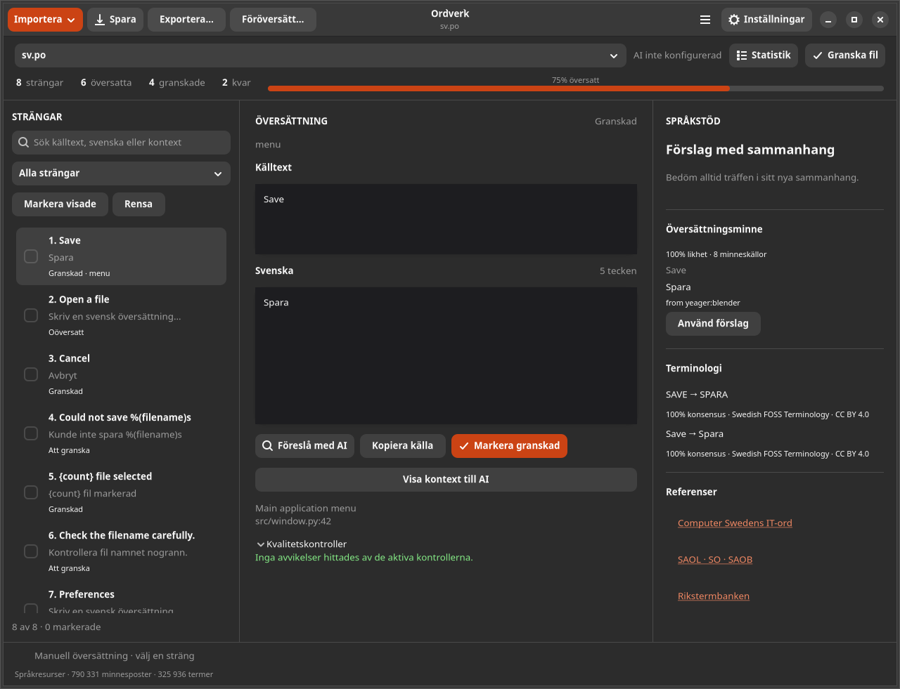

# Ordverk 0.3

En översättningsverkstad för Linux, byggd med **GTK4, libadwaita och Python**.
Gränssnittet finns endast på svenska. Översätt, redigera och granska PO, Qt TS,
XLIFF 1.2/2.x och JSON med svenska språkresurser och valfri AI- eller översättningstjänst.



## Kom igång

Krav: Python 3.11+, GTK 4.10+, libadwaita 1.4+, PyGObject, Git, GNU Gettext samt valfritt
Hunspell och Aspell. Både Debian/Ubuntu och Fedora kan köra appen.

Debian/Ubuntu:

```sh
sudo apt install python3 python3-venv python3-gi gir1.2-gtk-4.0 gir1.2-adw-1 git gettext hunspell aspell locales
# På Ubuntu finns GTK:s svenska översättningar i ett separat språkpaket:
# sudo apt install language-pack-gnome-sv
./scripts/install.sh
./run.sh
```

Fedora:

```sh
sudo dnf install python3 python3-pip python3-gobject gtk4 libadwaita git gettext hunspell aspell glibc-langpack-sv
./scripts/install.sh
./run.sh
```

Installationsskriptet skapar en virtuell miljö i projektets `.venv`, installerar
de verifierade revisionerna av `l10n-lint` och `svlang` och lägger in Ordverk.
Det ändrar inga systempaket. Om du vill ha Ordverk i programmenyn:

```sh
./scripts/install.sh --desktop
```

Startprogrammet använder den genererade Ordverk-ikonen. Behåll projektmappen
på sin plats efter installation av startprogrammet, eller kör skriptet igen
om du flyttar den. Ordverk väljer svenska även för GTK:s och libadwaitas
standardtexter, oavsett datorns språk. På Debian utan genererad svensk systemlokal
byggs språkdefinitionen från installerade systemdata och sparas i `~/.ordverk/locale`.
Systemets språkinställningar ändras inte.

## Import och arbetssätt

- **Filer**: välj en eller flera PO/POT-, TS-, XLF/XLIFF- eller JSON-filer.
- **Mappar**: undermappar söks igenom; `.git`, virtuella miljöer, `node_modules`,
  `vendor`, byggmappar och symboliska länkar hoppas över vid rekursiv import.
- **URL**: en direkt HTTPS-adress till en katalog.
- **GitHub**: ett offentligt förråd, en undermapp eller en fil. En import hämtar
  alla filer från samma ögonblicksbild. Privata förråd kan importeras med API-nyckel via Anslutningar.
- **Dra och släpp**: släpp filer eller mappar på fönstret.
- **Språkresurser**: egna PO-minnen och TBX/CSV-termbanker via importmenyn.

Importguiden frågar om du vill **översätta** eller **granska**, och arbeta
**manuellt** eller **automatiskt**. Valen kan sparas och guiden stängas av.
Den kan öppnas igen från huvudmenyn. Kataloger med ett annat uttryckligt
målspråk får en guide för att skapa tomma svenska arbetskopior.

Automatisk översättning fyller endast tomma fält. Den använder entydiga exakta
minnesträffar först och kan sedan använda AI om du aktiverat det. Motstridiga
minnesträffar kräver bedömning. Förslag med kvalitetsfel tillämpas inte. Alla
tillämpade förslag markeras för granskning; originalfiler skrivs först vid **Spara**.
Standardgränsen är 100 strängar per körning och kan ändras i avancerade inställningar.

## Importstatistik och kvalitetsfilter

Efter import öppnas en **Importstatistik**-popup med antal filer, strängar, ord,
översatta/granskade strängar och återstående arbete. Vid mappimport samlas alla
filer i en popup. En automatisk kvalitetsgranskning uppdaterar popupen med
stavfel, fel skiftläge, platshållare, taggar, skiljetecken, blanksteg, tal och
terminologianmärkningar. Pågående, avbruten och ofullständig granskning visas
uttryckligen. Efter sju sekunder visas förlopp och möjlighet att avbryta.

Menyn **Strängar** har motsvarande filter samt samlade urval för fel, varningar
eller alla kvalitetsanmärkningar. Urvalen kan också användas vid föröversättning.
De bygger på hittills kontrollerade strängar och uppdateras efter rättningar.
Varje sträng räknas en gång per kategori, även om båda stavningsmotorerna eller
flera pluralformer ger samma typ av anmärkning. Filövergripande anmärkningar
visas separat i popupen och i rapporten från **Granska fil**.

Skiftläge jämförs i båda riktningarna mellan källtextens och översättningens
första synliga bokstav; inledande taggar och platshållare hoppas över. Detta är
ett granskningsråd, eftersom språkens regler och sammanhang kan motivera en
skillnad. JSON utan kopplad källtext jämförs inte med nyckelns skiftläge.

Automatisk filgranskning är aktiverad som standard och kan stängas av under
**Inställningar → Enkelt → Granska filer efter import**. Popupen visas även då;
**Granska fil** fyller i kvalitetsresultaten manuellt. Statistik kan alltid
öppnas igen med **Statistik**.

## Föröversättning och diff

**Föröversätt** låter dig välja hela filen, aktuell sträng, visade strängar eller
valfria strängar markerade med kryssrutorna. Fler förval finns för oöversatta,
översatta, delvis översatta, granskade, strängar att granska, ändrade/oförändrade
sedan import, osparade ändringar, nya strängar och flera former. Samma filter
finns i vänsterpanelen. Ändringar sedan import jämförs med innehållet när filen
öppnades och finns kvar efter sparning. Föröversättningsdialogen visar antal i
urvalet. Välj översättningsminne och ordlistor, AI eller
språkresurser följt av AI. Ordlistor används bara för entydiga hela träffar.
Förslagen förhandsgranskas före tillämpning. Ifyllda fält ersätts bara om du
aktiverar det. Sena resultat skriver inte över strängar du redigerat under arbetet.

**Importera → Diff / patch** läser unified diff mot redan öppnade grundfiler.
Kontext och radnummer måste stämma exakt. Du kan markera ändringarna som
**granskade** eller **luddiga (fuzzy)** och redigera varje ändrad sträng och
variant före tillämpning. Diffen inkluderar också sina metadata- och
strukturändringar. Grundfilerna skrivs först när du väljer Spara. Nya eller
borttagna hela filer och binära diffar stöds inte.

**Importera → Uppdatera PO från POT** sammanfogar en ny mall med aktuell PO-fil
med GNU Gettext. Osparade översättningar ingår. Exakta träffar behålls och
liknande träffar kan tas med som luddiga; detta kan stängas av. En
förhandsgranskning visar antalet matchande, nya/ändrade, borttagna och luddiga
strängar. Borttagna poster bevaras som föråldrade. `POT-Creation-Date` hämtas
från mallen; om fältet saknas behålls tidigare datum. Uppdateringen tillämpas i
arbetskopian och originalfilen skrivs först vid Spara.

## Lokal export

**Exportera…** exporterar aktuell fil eller alla öppnade filer till en vald
mapp. Välj **originalformat, PO, Qt TS, XLIFF 1.2, XLIFF 2.0, JSON eller diff**.
Osparade ändringar ingår. Befintliga filer ersätts inte; ett numrerat tillägg
gör filnamnet unikt. Exporten ändrar inte arbetskopians sparningsstatus.

Vid formatbyte exporteras varje plural-/längdvariant som en separat post med
formen i kontexten. Inlinekoder återges som text. Välj originalformatet för
att behålla formatspecifik struktur och metadata. PO-export anger Ordverk som
generator och kompletterar nödvändiga MIME-fält. JSON-export använder explicita
källtexter och måltexter med kontext, kommentarer och granskningsstatus.

**Diff mot originalfilen vid import** skapar unified diff mot den ursprungliga
importen, även efter senare sparningar. Både strängar och PO-huvud ingår.
Diffen förhandsvisas och kontrolleras genom att appliceras på importens innehåll.
Även filer utan avslutande radbrytning stöds.

## Import och export till tjänster

**Anslutningar** finns i importmenyn och huvudmenyn. Spara valfria profiler:

| Tjänst | Inställningar | Export |
| --- | --- | --- |
| GitHub | Ägare, förråd, fil och befintlig gren | Commit med filändringen, skyddad med filens SHA |
| Weblate | API-adress, projekt och komponent | Översättningar eller förslag; skyddar motstridiga godkända texter |
| Transifex | Organisation, projekt och resurs | Asynkron import av svensk översättningsfil |
| Crowdin | API-adress, numeriskt projekt-ID och fil-ID | Översättningar utan automatiskt godkännande |

Använd resursens ursprungliga filformat. Profilerna finns i
`~/.ordverk/connections.json`. API-nycklar används för sessionen eller sparas
uttryckligen i systemnyckelringen. Nycklar vidarebefordras aldrig till signerade
nedladdningsadresser. Export visar destination, ändringsdiff och granskningsråd
före sändning. GitHub stoppar samtidiga filändringar atomiskt; övriga tjänster
jämförs igen före sändning men saknar motsvarande atomiska skydd i fil-API:t.

**Skicka via e-post / TP** förväljer `robot@translationproject.org`, filnamnet
som ämne och originalformatets fil som bilaga. Ett MIME-utkast sparas under
`~/.ordverk/outbox` och öppnas via `xdg-email` i e-postprogrammet, där du väljer
avsändare och skickar. TP använder normalt `paket-version.sv.po`. Utkastet
skickas inte automatiskt av Ordverk.

## Redigering och kvalitet

Vänsterpanelen visar strängar med sökning, statusfilter och strängnummer från
originalfilens ordning. Numren behålls vid sökning och filtrering. I mitten finns
källtext och en fritt redigerbar svensk översättning, kontext, kommentarer och
separata plural-/längdvarianter. Högerpanelen visar minnesträffar, terminologi
och AI-förslag med motivering. Redigeraren har ångra/gör om.

**Huvudmenyn → Redigera PO-huvud…** redigerar projekt/version, felrapporteringsadress,
mallens datum, revisionsdatum, senaste översättare, översättningsgrupp,
huvudkommentar och egna huvudfält. Ändringarna kan granskas innan filen sparas.

Under **Inställningar → Enkelt → Översättare** anger du namn och e-postadress.
PO-sparning uppdaterar normalt `Last-Translator` från dessa uppgifter samt
`PO-Revision-Date` till aktuellt datum, tid och tidszon. Saknas en egen
identitet behålls tidigare översättare. `POT-Creation-Date` ändras av en ny
POT-import eller i huvudredigeraren. `X-Generator` sätts till `Ordverk 0.3`.
Inställningarna sparas i `~/.ordverk/settings.json`.

Vid avslut med osparade ändringar visas berörda filer och valen **Fortsätt arbeta**,
**Stäng utan att spara** och **Spara alla och avsluta**. Avbruten eller misslyckad
sparning lämnar appen öppen. Pågående filjobb behöver slutföras eller avbrytas
innan avslut. Även ändringar i PO-huvudet och kopplade JSON-källtexter omfattas.

| Resurs | Användning |
| --- | --- |
| [swedish-tm](https://github.com/yeager/swedish-tm) | Indexerade exakta och liknande träffar från 15 ekosystem, med källhänvisning |
| [swedish-foss-terminology](https://github.com/yeager/swedish-foss-terminology) | Termer och konsensusandel i redigeraren och AI-kontexten |
| [l10n-lint](https://github.com/yeager/l10n-lint) | Platshållare, formatering, pluralformer, syntax och katalogkontroller |
| [svlang](https://github.com/yeager/svlang) | Skrivregler, särskrivningar och råd om svengelska per sträng |
| [hunspell-sv](https://github.com/yeager/hunspell-sv) | Stavning, böjningar och sammansättningar via systemets Hunspell-motor |
| [aspell-sv](https://github.com/yeager/aspell-sv) | Kompletterande stavningskontroll via systemets Aspell-motor |

**Granska fil** kör l10n-lint, svlang, terminologiråd och båda aktiva stavningsmotorerna på arbetskopian, inklusive osparade ändringar. Rapporter kan exporteras
som JSON. **Markera granskad** kontrollerar samtliga varianter, kräver att de är
ifyllda utan blockerande fel och lägger översättningen i ditt eget lokala minne.
Du kan även exportera det egna minnet till PO.

Minneslikhet och termkonsensus är olika mått och ingen av dem bevisar språklig
korrekthet. Ursprungliga kontexter och pluralidentiteter saknas i delar av
swedish-tm. Aspells svenska ordlista är en förhandsversion och kan avvisa korrekta
nya sammansättningar. Därför visas ordlisteutfall som granskningsråd.

## Cache och uppdateringar

All konfiguration och alla egna data ligger i **`~/.ordverk`**:

```text
~/.ordverk/
  settings.json           inställningar utan API-nyckel
  resources.sqlite3       indexerat minne och terminologi
  versions.json           observerade resursversioner och ETag
  provenance.json         ursprung, filversion och SHA-256
  upstream/
    swedish-tm/           PO-exporter
    swedish-foss-terminology/termbank-flat.csv
    hunspell-sv/          dina sv_SE.aff och sv_SE.dic
    aspell-sv/swedish/    dina ordlistekällor och lokalt byggd sv.rws
```

Vid varje start kontrolleras senaste versionerna i dina GitHub-förråd i
bakgrunden. ETag och Git-filidentifierare undviker onödiga nedladdningar.
Misslyckad versionskontroll lämnar befintliga index tillgängliga. Den första
fullständiga hämtningen omfattar ungefär 170 MB och indexet kräver ytterligare
diskutrymme. Senare ändringar hämtas och indexeras per resursfil.

**Både dina Hunspell- och Aspell-data används direkt från cachen**, före
systemets svenska ordlistor. Aspells binära ordlista byggs lokalt när dess
källfiler ändras. Själva Hunspell/Aspell-motorerna installeras med distributionens
pakethanterare. `l10n-lint` och `svlang` är kodberoenden och uppdateras inte som
nedladdade data under appstart.

Standardexporten för terminologi är CSV eftersom den bevarar även de två
kontrollteckenposter som TBX-exporten undantar. Egna TBX-filer stöds också.
Inställningarna kan stänga av uppdateringar eller välja enskilda resurser.
Miljövariabeln `ORDVERK_HOME` kan välja en annan cachekatalog.

## AI och inställningar

**Enkelt**: projektets sammanhang, domän, importguide, uppdateringar,
tjänsteförval, API-basadress, modell, sessionsnyckel och översättningsanvisningar.

**Avancerat**: resursval, motorer, egna ordlistesökvägar, miljövariabel för
API-nyckeln, antal närliggande strängar i AI-kontexten och gränser för automatiskt arbete.

Inställningarna har förval för **OpenAI, Anthropic/Claude, X/Grok och DeepL**,
samt en egen OpenAI-kompatibel tjänst. DeepL har separata val för API Free och
API Pro. Förvalen fyller i adress, modell och miljövariabel för nyckeln;
adress och modell kan anpassas. DeepL väljer modell automatiskt.

| Förval | Modell | API |
| --- | --- | --- |
| OpenAI | gpt-5.6-terra | Chat Completions |
| Anthropic / Claude | claude-sonnet-5 | Messages |
| X / Grok | grok-4.6 | Chat Completions |
| DeepL API Free / Pro | Väljs av tjänsten | Textöversättning |
| Egen tjänst | Valfri | OpenAI-kompatibelt |

Lokalt fungerar exempelvis en kompatibel server på `http://localhost:11434/v1`;
fjärranslutningar kräver HTTPS. Konton kan ha olika modelltillgång.
API-kontrakten och officiella referenser finns i [docs/API.md](docs/API.md).

**Kontext till översättningen** kombinerar manuellt projektsammanhang och egna
översättningsanvisningar med filnamn, projektmetadata, kommentarer,
källkodshänvisningar, pluralform och närliggande strängar. Automatisk filkontext
kan stängas av; antalet grannsträngar kan väljas mellan 0 och 10 per sida.
Översättningsminne och terminologi kompletterar underlaget. **Visa kontext till AI**
visar underlaget utan API-anrop. Bara den valda källtexten översätts.

DeepL får kontext via sitt särskilda kontextfält. Platshållare och inlinekoder
skyddas med XML-markörer och kontrolleras efter svaret. Samma lokala
kvalitetskontroller granskar förslag från samtliga tjänster.

Nyckeln kan anges för sessionen, läsas från `ORDVERK_API_KEY` (valbart namn)
eller sparas i en stödd Secret Service/KWallet-nyckelring. Den skrivs aldrig till
`settings.json`. API-anrop skickar vald källtext, aktuell översättning, kommentarer,
projektkontext, aktiverad filkontext samt relevanta minnes- och termträffar till den valda tjänsten.
Det sker när du begär ett AI-förslag eller uttryckligen har aktiverat automatisk AI.

LLM-tjänster ombeds lämna översättning och kort motivering som JSON. Resultatet
granskas med de lokala kontrollerna. Ett sent API-svar får inte skriva över en
sträng som du ändrat under anropet. Nätverksanrop har tidsgränser och inga
automatiska försök som kan upprepa kostnadsbelagda anrop.

## Statistik och förlopp

Huvudfönstret visar totalt antal strängar, översatta, granskade, återstående och
översättningsgrad. **Statistik** visar också fördelning per fil, antal ord och
plural-/längdvarianter samt tillämpade minnes- och AI-förslag under sessionen.
En sträng räknas som översatt när alla dess varianter är ifyllda.

Förloppsmätare visas efter **7 sekunder** för bakgrundsjobb, resursuppdatering
och enskild språkgranskning. Kända arbetsmängder visar antal/procent; annars
pulserar mätaren. Aktuell aktivitet visas från start. Avbryt stoppar fortsatt
arbete; ett redan pågående nätverksanrop kan behöva slutföras eller nå sin
tidsgräns. Filskrivningar slutförs atomiskt.

## Filformat och sparning

- PO bevarar metadata, kontext, kommentarer, referenser, formatflaggor och
  pluralformer. Ändrade osäkra poster får `fuzzy` tills du markerar dem granskade.
- Qt TS bevarar meddelandekontext, numerus, längdvarianter, status och okända attribut.
- XLIFF bevarar dokumentstrukturen och taggar. Inlinekoder visas som `⟦1⟧`
  och `⟦/1⟧`; alla koder och deras nästling måste bevaras vid redigering.
  Enheter med `translate="no"` hoppas över.
- JSON stöder nästlade objekt/listor och explicita `source` + `target`,
  `translation` eller `value`. `translate: false`, metadata och icke-textvärden
  bevaras. För strängnycklar som `menu.save` kopplar du en engelsk käll-JSON,
  eller skapar en svensk arbetskopia från källfilen via importguiden.

Oförändrade arbetskopior återges byte för byte. Vid PO-sparning/export kan
generator-, MIME- och översättaruppgifter uppdateras. Ändrade filer serialiseras på nytt;
indrag och citatstil kan därför ändras utan att innehållets struktur ändras.
Sparning skapar en innehållsidentifierad `.ordverk-….bak` bredvid en befintlig
ändrad fil och kontrollerar om filen har ändrats utanför Ordverk. Exporten
tolkas på nytt innan den skrivs. Efter varje sparning och export läses filen
tillbaka, jämförs byte för byte och tolkas igen. Sparning kontrollerar också
att antal strängar, samtliga former och översättningar bevaras. PO kontrolleras
med Gettexts `msgfmt --check-format`. Filen markeras som sparad först när
kontrollerna passerat. Formatbyte görs genom exportdialogen.

JSON har ingen gemensam granskningsflagga. Ordverk bevarar dess granskningsstatus
i `~/.ordverk/catalogs` när filen sparas, tillsammans med kopplade källtexter. Ändrad fil eller källreferens ogiltigförklarar sparad granskningsstatus.

## Kortkommandon

| Tangenter | Åtgärd |
| --- | --- |
| Ctrl+Q | Avsluta med kontroll av osparade ändringar |
| Ctrl+O | Importera filer |
| Ctrl+S | Spara aktuell fil |
| Ctrl+Skift+S | Spara som |
| Ctrl+Retur | Markera strängen granskad |
| Alt+Ned / Alt+Upp | Nästa / föregående sträng |
| Ctrl+Z / Ctrl+Skift+Z | Ångra / gör om i textredigeraren |

## Utveckling och verifiering

```sh
./scripts/install.sh
.venv/bin/python -m pip install -e '.[dev]'
.venv/bin/python -m pytest
GDK_BACKEND=x11 GSK_RENDERER=cairo GTK_A11Y=test xvfb-run -a dbus-run-session -- .venv/bin/python tests/gtk_smoke.py
.venv/bin/python -m ruff check src
desktop-file-validate data/io.github.yeager.Ordverk.desktop
.venv/bin/python -m build
```

Tester täcker filernas bevarande, XML-koder, pluralformer, externa filändringar,
backup, import, terminologi, cache, privata stavningsordlistor, statistik,
förloppsgränsen och API-kontrakt via en lokal HTTP-testserver. GTK-testet öppnar
riktiga fönster och provar redigering, sparning, granskning och dialoger.
Verifiering mot ett betalt externt LLM-API kräver egen tjänst, modell och nyckel.

Kommandoradsstöd:

```sh
ordverk --version
ordverk --check examples/sv.po
ordverk --update-resources
ordverk --update-resources tm-small terms hunspell aspell
```

Koden är modulär: `catalog.py` hanterar format och säkra skrivningar,
`importers.py` import, `resources.py` cache och sökning, `quality.py` kontroller,
`llm.py` API-anrop, `workflow.py` automatiskt arbete och `ui.py`/`dialogs.py`
GTK-gränssnittet. Se [tredjepartsnotiser](THIRD_PARTY.md) och
[ikonens genereringsprompt](data/icon-prompt.txt).

## Native paket och CI

Aktuell release är **0.3**; första releasen var **0.2**. Se [ändringsloggen](docs/ANDRINGAR.md). GitHub Actions kör Linux-tester, GTK-test, Gitleaks,
Debian-bygge med debhelper/pybuild och Fedora-bygge med RPM:s pyproject-makron.
Paketen följer systemens standardplatser och deklarerar beroenden. `l10n-lint`
och `svlang` levereras som separata `python3-*`-paket från verifierade källrevisioner.
Installera alla tre DEB-paketen tillsammans med `apt install ./*.deb`, eller
RPM-paketen med `dnf install ./*.rpm`. Källpaket och byggrecept följer med.

För byggmiljöernas paketlistor och kontroller, se `.github/workflows/ci.yml`.
`scripts/native_sources.py` verifierar upstreamarkivens SHA-256 före byggning.
Inga installationsskript laddar ner Pythonberoenden vid installation av native paket.
